# Setup for the Retail use case lab
- [Setup for the Retail use case lab](#setup-for-the-retail-use-case-lab)
  - [Introduction](#introduction)
  - [Virtual machine option](#virtual-machine-option)
  - [Lab materials](#lab-materials)
    - [Local machine](#local-machine)
      - [VS Code](#vs-code)
    - [Virtual machine](#virtual-machine)
      - [VS Code](#vs-code-1)
  - [Environments](#environments)
    - [watsonx.ai](#watsonxai)
      - [The .env file](#the-env-file)
      - [API key](#api-key)
    - [Entitlement key](#entitlement-key)
      - [Local machine](#local-machine-1)
      - [Virtual machine](#virtual-machine-1)
    - [watsonx Orchestrate ADK](#watsonx-orchestrate-adk)
      - [Local machine](#local-machine-2)
      - [Virtual machine](#virtual-machine-2)
    - [watsonx Orchestrate](#watsonx-orchestrate)
    - [Tavily](#tavily)

## Introduction

This document contains the documentation for the setup of the environment to prepare for the step-by-step walkthrough of the [Retail use case](../usecases/retail/).

The use case takes you through the creation of tools and agents using the [IBM watsonx Orchestrate Agent Development Kit (ADK)](https://developer.watson-orchestrate.ibm.com/). This toolkit can be installed on a local machine and brings with it the core components of watsonx Orchestrate, as container images that are running in a container runtime like Docker or Rancher. It also installs a CLI that can be used to manage a locally running instance as well as remote instances running in the cloud.

## Virtual machine option

For this lab, you have the option to define and run the agents locally on your own laptop, using the ADK. The system requirements are mentioned/referenced in the [ADK install section](#watsonx-orchestrate-adk) below.

If you are unable to run the ADK locally, your instructor will provide you with access to a virtual machine that has the ADK already installed. You can access the VM by using a console link that opens a view of the VM's desktop UI in a browser tab.

Click the **Ctrl-Alt-Delete CAD** button (annotated with red arrow) to be prompted to enter username and password. Keep the default username as **Administrator** and enter the password **IBMDem0s** in the password field (annotated with red rectangle) and hit **ENTER**.

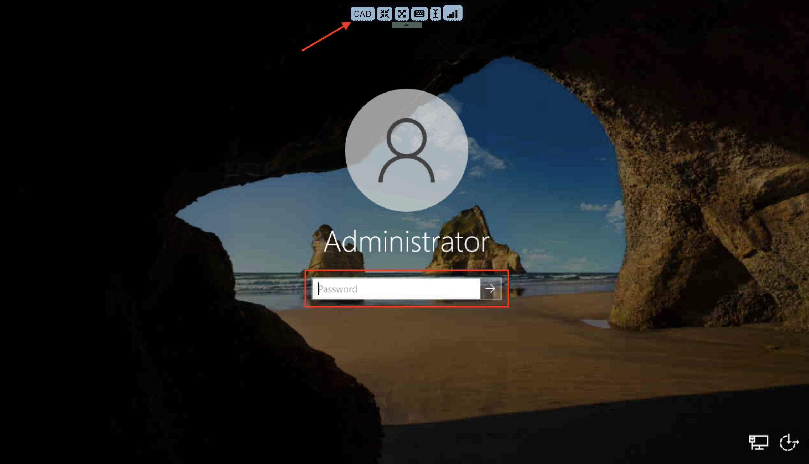

*Optional* It is also recommended to resize the virtual screen to Full Screen. To do so, click the **Resize** icon (annotated with red arrow) and select **Fullscreen** (annotated with red rectangle).

If you get a pop-up about an Unplanned shutdown, cancel that pop-up. 

Once logged into the Windows VM, let's start `Rancher Desktop`. This is the container runtime we will use later for the ADK. On the home screen, double-click the Rancher Desktop icon.


You will see in the Rancher console that it is starting up the service. Once that has completed, you can minimize the window, since we won't need it anymore.

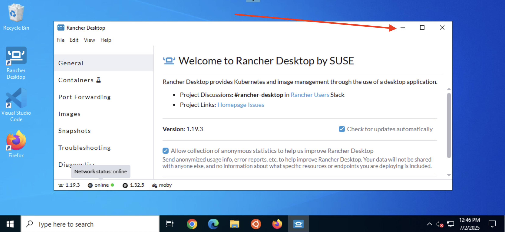

Next, you need to open a command line terminal with access to the WSL instance. To start, click the **Ubuntu** icon (annotated with red arrow) pinned to the taskbar to start the Ubuntu terminal. Alternatively, you can type **ubuntu** into the search field (annotated with a red oval) and click the **Ubuntu** app (annotated with a red rectangle).

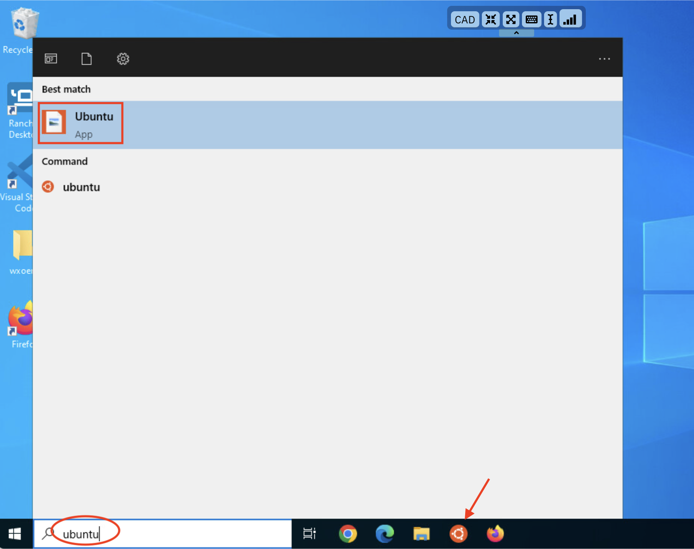

In the Ubuntu terminal, you need to activate the Python environment, which is already setup and has the watsonx Orchestrate ADK pre-installed.
```
source /home/techzone/wsl_wxoenv/bin/activate
```


## Lab materials

The materials for this lab will be given to you by your instructor in the form of a zip file. You need to unzip this file into a folder on your machine. The file contains a set of markdown files that represent the instructions for various parts of the bootcamp (including this very file), as well as code samples that you are going to use. Where to unzip the file differs based on whether you are running this lab on your local machine or on a virtual machine provided to you.

### Local machine

In this case, you can choose any folder as the base for the material. You should use that same folder as the current directory when installing the ADK (which is described in more detail [below](#watsonx-orchestrate-adk)). After unzipping, listing the files in a command terminal should look like shown below (this screenshot is taken on MacOS):


#### VS Code
We recommend you use VS Code to view the materials and edit files as needed. Assuming you have the command line starter installed, you should be able to start VS Code right from the command line by entering `code .`.

### Virtual machine

The virtual machine is using Windows as its operating system; however, we will be using the "Windows Subsystem for Linux (WSL)" to run the ADK. When downloading and unzipping the file with materials, you should put it into the folder that has been precreated.

After you open the VM console in your browser, you will see the Windows user interface. There, you can open a Firefox browser window and enter the address your instructor gave you. In the example below, the zip file exists as a downloadable file in Box:

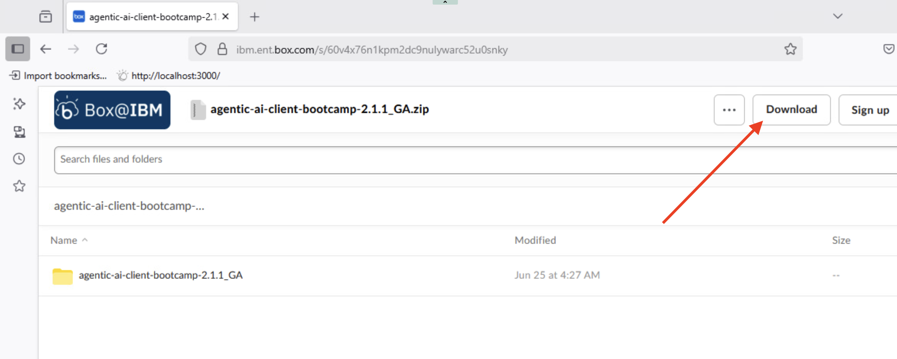

When clicking on the Download button, the file will be downloaded into the `Downloads` folder on the Windows machine. Open that folder by simply clicking on the `Show all downloads` button.


Then click on the `Show in Folder` icon to open the file explorer window,as shown below.

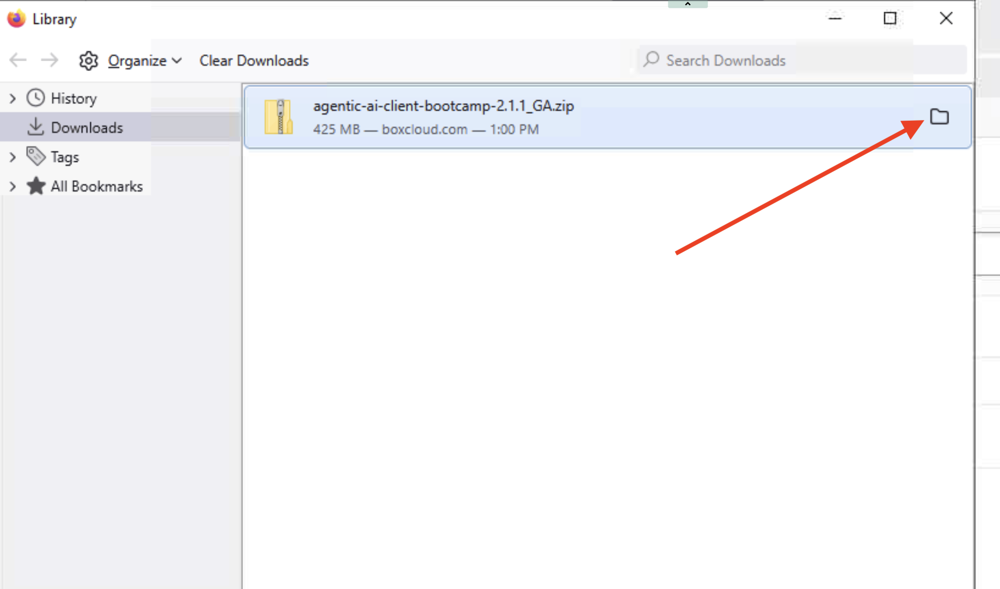

Right-click on the zip file and select `Copy`.

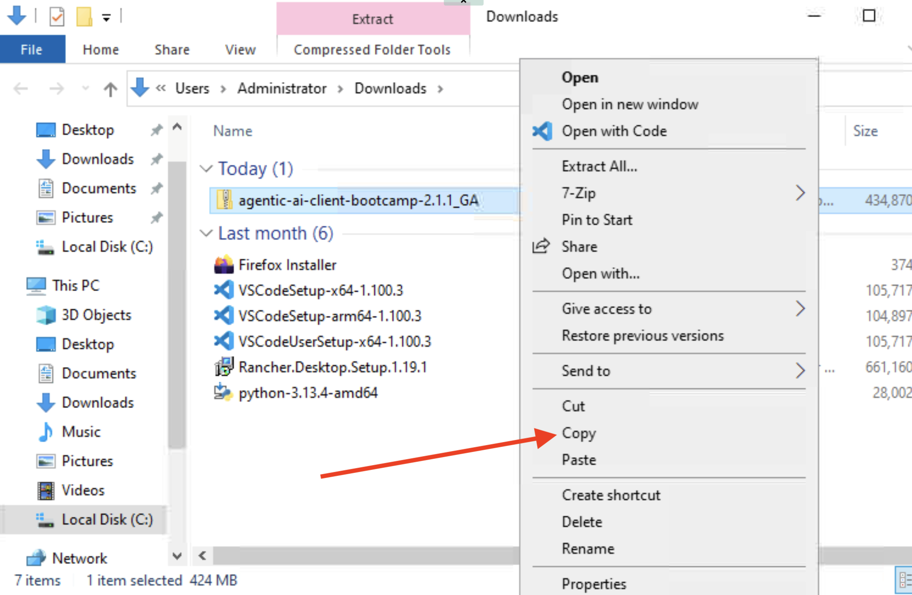

Now navigate to the `Ubuntu` folder under `Linux` on the left side of the file explorer menu.

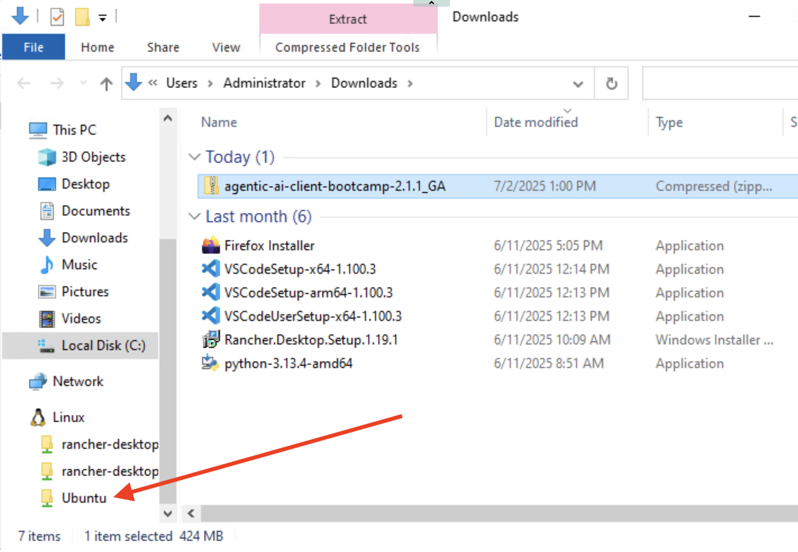

In the folder, navigate to `home -> techzone -> wxo_dev_edition`, right click and click on Paste.

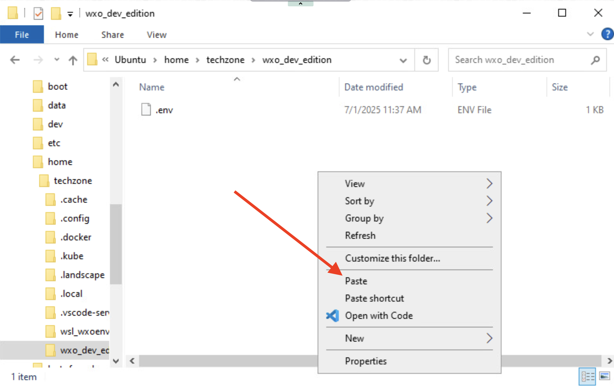

Open the folder and right-click on the zip file. In the context window for the zip file, select `Extract all`. You may receive a warning that this file is from the Internet. Click OK.

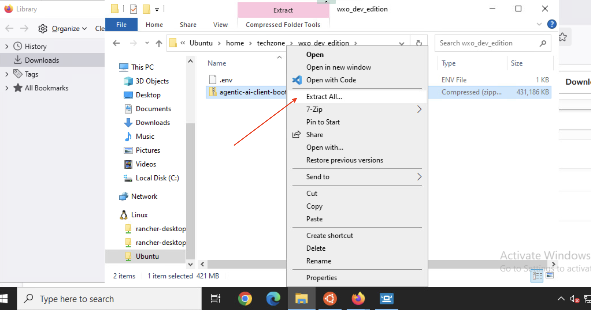

As the destination, make sure you enter the `wxo_dev_edition` (which is not the default), as shown below. Then click on `Extract`.

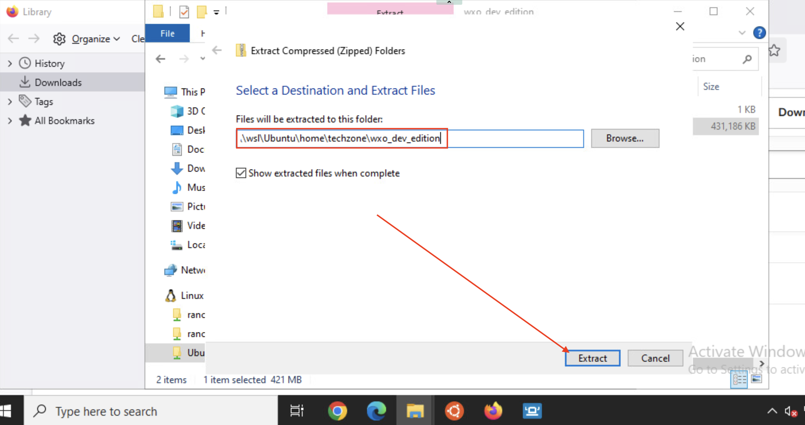

Note that the extraction process can take a couple of minutes. After it completes, your file explorer window should show the extracted files in the `wxo_dev_edition` folder. If they are placed into a subfolder, you can cut and paste them.

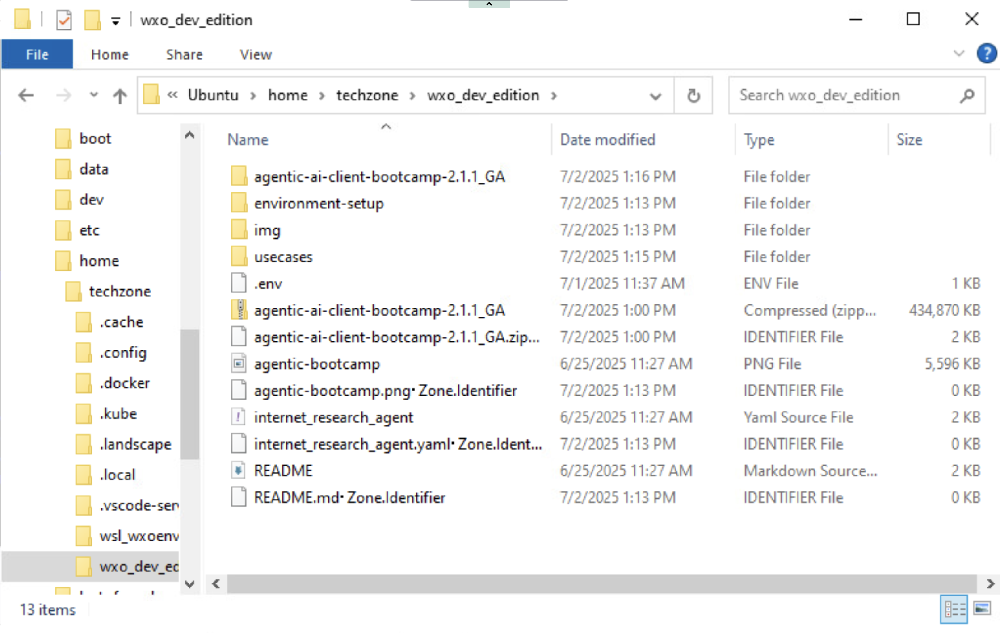

#### VS Code

VS Code is already installed on the Windows-based virtual machine. To open it, simply type "code" into the search field at the bottom left of the screen. The "VS Code" app will automatically be offered as a choice, and you can open it by clicking on the app icon.

 The application will automatically open the folder with all the files you are going to need during this lab.

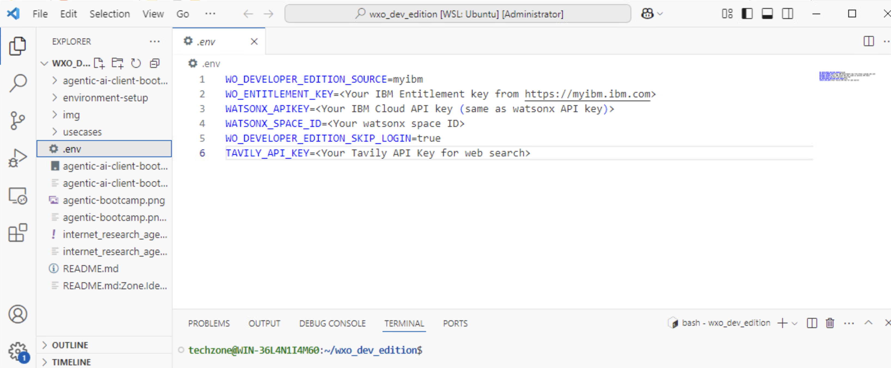

## Environments

To run the lab end to end, you need a number of environments.

### watsonx.ai

For the lab, as well as for the install of the Developer's Edition of watsonx Orchestrate, you will need access to an IBM watsonx.ai Runtime instance, and specifically, a `deployment space ID` for that instance as well as an `API key` for the IBM Cloud account the instance is running in. 

Your instructor should have given you access to the instances of watsonx Orchestrate and watsonx.ai that you will use throughout the bootcamp. To access them, you start out by logging into your IBM Cloud account at https://cloud.ibm.com. You can find the resources that you have access to in that account when going to the so-called "hamburger menu" on the top left of the page and clicking on `Resource list`.

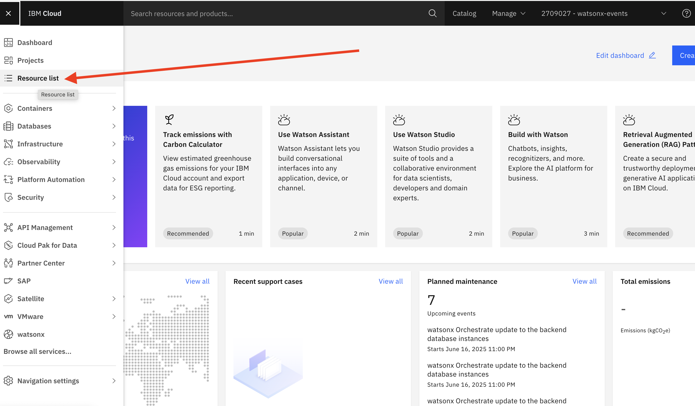

On the page with all your resources, you can find your watsonx.ai Runtime instance in the `AI / Machine Learning` section. The instance will have `watsonx Runtime in the Product column. Click on the name of the instance.


This will open the details page for the resource. Expand the `Launch in` drop-down list and click on `IBM watsonx`.


After opening the watsonx console, you can close both the Welcome and the Dive deeper pop-up windows. Now, click the 'hamburger menu' on this page, again at the top left of the page, and select `View all deployment spaces`.


In the following view, depending on whether you have already run a different lab, you may or may not see any deployment spaces listed. However, here we will just create a new one. Click on the `New deployment space` button.


Give the new space a descriptive name. All other fields are optional. The `Storage` field should already be filled in. Click on `Create`.


Once the space is ready, click on `View new space`. 


On the details page for the new space, select the `Manage` tab.


On the Manage page, make sure the space is associated with your watsonx.ai Runtime instance, and set it if it is not. (Hit Save if you need to set it.)


The last step here is that we need to capture the Space GUID. You can find the GUID also on the Manage tab. Simply click on the icon next to it to copy it to your clipboard.


#### The .env file

The Space GUID, as well as a number of other environment variables, goes into a file called `.env`. This file should exist in **the root folder** of where you extracted the content of this repo. You can use the .env.sample file as an example.

- If you are using the virtual machine with a pre-installed ADK, you already have this file in the `wxo_dev_edition` folder in the WSL environment within that virtual machine. 
- If you are running this on your local machine, you should have already unzipped the file with materials into a folder of your choosing, as described [above](#local-machine). Create an empty .env file and make sure you place the `.env` file in that same folder. 

You can edit the file with an editor of your choosing. We recommend using VS Code for this. 

Add the Space GUID value that you captured above to the `WATSONX_SPACE_ID` variable.


#### API key

You also need an API key for the IBM Cloud account that your watsonx.ai instance is on. To obtain one, open the IBM Cloud console (https://cloud.ibm.com) as before and select `Access (IAM)` option from the `Manage` dropdown at the top of the page.


On the following page, select `API keys` from the menu on the left.


You may or may not already have an API key listed, and if so, feel free to use it (note that you cannot see the value of an existing API key after you initially created it). Or you can simply create a new one by clicking on the `Create` button.


Give the new key a descriptive name, and click on `Create`.


Once the key has been successfully created, make sure you copy its value to the clipboard by clicking on the `Copy` link. As mentioned above, you won't be able to retrieve this value later.


The API key also goes into the .env file, add it to the `WATSONX_APIKEY` variable.


### Entitlement key
The watsonx Orchestrate Developer Edition, which you will use extensively in this lab, consists of a number of container images that are downloaded from the IBM registry during install. To authenticate with this registry, you need an "entitlement key".

#### Local machine
Your instructor will provide the entitlement key for you.
You can add the key to your .env file via editor, to the `WO_ENTITLEMENT_KEY` variable.

Also, make sure you have the `WO_DEVELOPER_EDITION_SKIP` variable set to `false`.

#### Virtual machine
The Developer Edition is already preinstalled on the virtual machine, which includes downloading the container images. Since they are cached on the virtual machine, no entitlement key is required and you can leave the variable unset. However, make sure that the `WO_DEVELOPER_EDITION_SKIP` variable set to `true`.

### watsonx Orchestrate ADK

As mentioned above, the ADK allows hosting the core Orchestrate components on a developer laptop. For the lab, you can choose if you want to run the ADK on your own laptop or on a virtual machine that will be provided to you by your instructor. 

#### Local machine

To run it on your own laptop, you need to install 
- [Docker](https://www.docker.com/products/docker-desktop/) or [Rancher](https://www.rancher.com/products/rancher-desktop)
  - the containers that run as part of the ADK will require ~12GB of memory, so you need to allocate at least that much to the virtual machine hosting the container runtime
- Python 3.11
- Visual Studio Code

Once you have these prerequisites available, you can install the ADK by following the instructions at [the ADK install page](https://developer.watson-orchestrate.ibm.com/getting_started/installing).

> **Note**: These instructions were created for a specific version of the ADK, namely version **1.8.0**. We recommend you specify that version when running the install: `pip install ibm-watsonx-orchestrate==1.8.0`.

You also need to install the watsonx Orchestrate Developer Edition, which is part of the ADK, by following the related [install instructions](https://developer.watson-orchestrate.ibm.com/getting_started/wxOde_setup). However, **DO NOT** set up the .env file as described in the instructions! You already have the right values in your .env file if you followed the instructions above.

After you created the .env file with the values given to you, you can follow the instructions to start the server for the first time as documented [here](https://developer.watson-orchestrate.ibm.com/getting_started/wxOde_setup#installing-the-watsonx-orchestrate-developer-edition-with-adk). Note that the first time you run it, it will download all the required container images from the IBM image registry, which will take some time. Also, make sure you specify the `-i` option to allow the server to collect telemetry data.

#### Virtual machine

At this point, you should have filled in the required values into the .env file using VS Code as described above. You should also have a command line terminal open in the UI, with `wxo_dev_edition` as the current folder.

Alternatively, you can also use the built-in terminal window in VS Code, which is located below the main editor window. Make sure you activate the Python environment as shown in the picture below.


> You don't need to set the Tavily API key here, we will show how to obtain and set that key [below](#tavily).

You can start the Orchestrate server by entering the following command:
```
orchestrate server start --env-file .env -i
```

When running it for the first time, it may take a bit longer to start, depending on whether it has to download the latest versions of the container images (the images should all be cached in the virtual machine already, though). Note that the `-i` option tells the server to collect elemetry data that we can later use to monitor it.


Once you see the message that the server has been started and that you should activate the local environment, enter the following:
```
orchestrate env activate local
```


### watsonx Orchestrate 

In this lab, you will create a number of components (tools, agents, etc) in your local environment and run and test them there, without the need to access an instance of watsonx Orchestrate in the cloud. However, the last part of the lab describes how you can take the same components and easily deploy and run them on a watsonx Orchestrate SaaS instance. You need such an instance for that part of the lab.

Your instructor will provision both the watsonx.ai and the watsonx Orchestrate instances for you and you can find the watsonx Orchestrate resource in the IBM Cloud resource list. This is only needed for the last part of the lab.

### Tavily

One of the tools you will create during the lab is a web search tool that takes advantage of a service called "Tavily". To use it, you need an API key that is passed with every search request.

Go to https://www.tavily.com/ and click on `Log in`.


Now click on `Sign up`.


You can sign up with your Google ID, or Github ID, or your email address. Once you have successfully completed the signup process and can log into the service, your page should look like this: 


Click on the Plus sign as shown in the setup-image above. Name your key "default". After it has been created, you can copy its value to the clipboard by clicking on the copy icon next to your key:


To complete the setup for this use case, we will add the Tavily API key to the .env file as before, with an editor of your choice. Add your key to the `TAVILY_API_KEY` variable.

This is it! You are now ready to proceed to the [detailed lab instructions](../usecases/retail/retail.md).